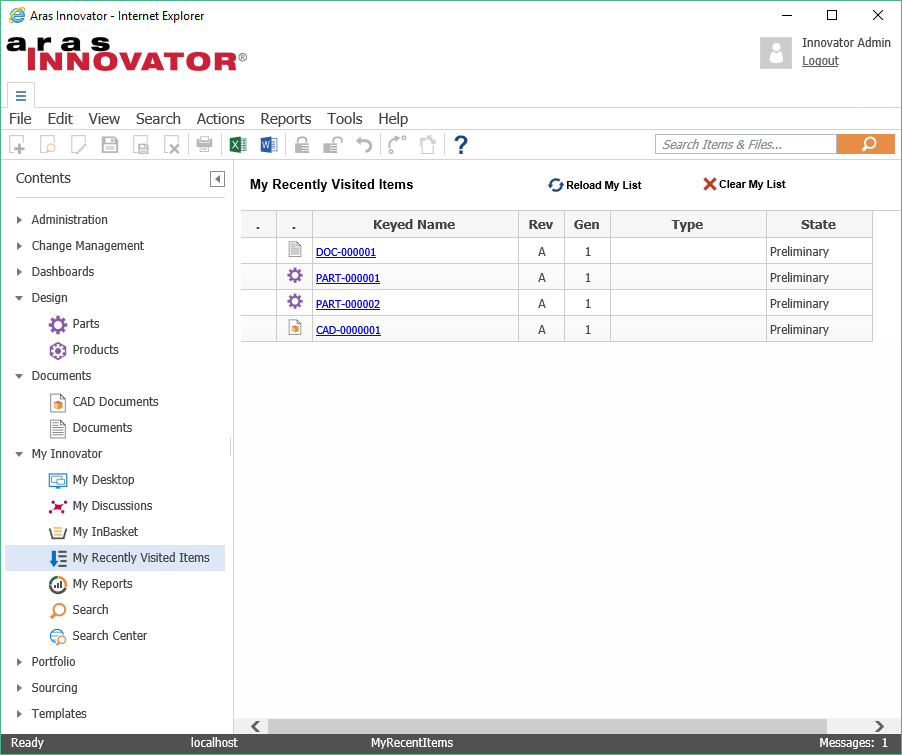

# My Recently Visited Items

Current version [v4](https://github.com/ArasLabs/my-recent-items/releases/tag/v4) supports Aras Innovator 11 SP9+.

This Add-On Package adds a stack to track the N recently visited items per user login. Item Types to be tracked can be configured to be any ItemType. (default = Document, Part, CAD,Project,Manufacturer Part,Manufacturer,Express ECO, PR,).

On the TOC, under "My Innovator", a new line "My Recently Visited" will show.

Improved configurability and multi language support

This is actually a remake of an older Add-on solution with better performance and more compact.

## History

This project and the following release notes have been migrated from the old Aras Projects page. Unlike community projects that have been migrated and archived, this project will be updated for compatibility with the latest release of Aras Innovator.

Release | Notes
--------|--------
[v4](https://github.com/ArasLabs/my-recent-items/releases/tag/v4) | Update to support Aras Innovator 11 SP9.
[v3](https://github.com/ArasLabs/my-recent-items/releases/tag/v3) | Aras 11 and Aras 10SP4++. Solution Package and Documentation. It loads on top of the standard ARAS Solutions PE,PM without any conflicts. See Readme.txt for installation steps.
[v2](https://github.com/ArasLabs/my-recent-items/releases/tag/v2) | Solution Package and Documentation. It loads on top of the standard ARAS Solutions PE,PM,QP without any conflicts.
[v1](https://github.com/ArasLabs/my-recent-items/releases/tag/v1) | Solution Package and Documentation. It loads on top of the standard ARAS Solutions PE,PM,QP without any conflicts.

#### Supported Aras Versions

Project | Aras
--------|------
[v4](https://github.com/ArasLabs/my-recent-items/releases/tag/v4) | 11 SP9+
[v3](https://github.com/ArasLabs/my-recent-items/releases/tag/v3) | 10 SP4+, 11.0
[v2](https://github.com/ArasLabs/my-recent-items/releases/tag/v2) | 10 - 10 SP3
[v1](https://github.com/ArasLabs/my-recent-items/releases/tag/v1) | 9.3 SPx, 9.4 SPx

## Installation

#### Important!
**Always back up your code tree and database before applying an import package or code tree patch!**

### Pre-requisites

1. Aras Innovator installed
2. Aras Package Import tool
3. **my-recent-items** import packages

### Install Steps

1. Backup your database and store the BAK file in a safe place.
2. Open up the Aras Package Import tool.
3. Enter your login credentials and click **Login**
  * _Note: You must login as root for the package import to succeed!_
4. Enter the package name in the TargetRelease field.
  * Optional: Enter a description in the Description field.
5. Enter the path to your local `..\my-recent-items\Import\0-Delete - core Extensions (of prev Version)\imports (root).mf` file in the Manifest File field.
6. Select **Common Utilities** in the Available for Import field.
7. Select Type = **Merge** and Mode = **Thorough Mode**.
8. Click **Import** in the top left corner.
9. Repeat steps 5-8 for the following packages:
  * `..\my-recent-items\Import\1-Common Grid Utilities v3-0 (partial)\imports (admin).mf`
  * `..\my-recent-items\Import\2- Import - AddOn-Solution\imports (admin).mf`
  * `..\my-recent-items\Import\3-Configuration Data\imports (admin).mf`
  * Optional: `..\my-recent-items\Import\SetPackageVersion (optional)\imports (admin).mf`
10. Close the Aras Package Import tool.

## Usage

See [My Recently Visited Items  - Add-On v3-0.pdf](./Documentation/My%20Recently%20Visited%20Items%20%20-%20Add-On%20v3-0.pdf) for more information on using this project.

## Contributing

1. Fork it!
2. Create your feature branch: `git checkout -b my-new-feature`
3. Commit your changes: `git commit -am 'Add some feature'`
4. Push to the branch: `git push origin my-new-feature`
5. Submit a pull request

For more information on contributing to this project, another Aras Labs project, or any Aras Community project, shoot us an email at araslabs@aras.com.

## Credits

Created by Rolf Laudenbach for Aras Corporation.

## License

Aras Labs projects are published to Github under the MIT license. See the [LICENSE file](./LICENSE.md) for license rights and limitations.
